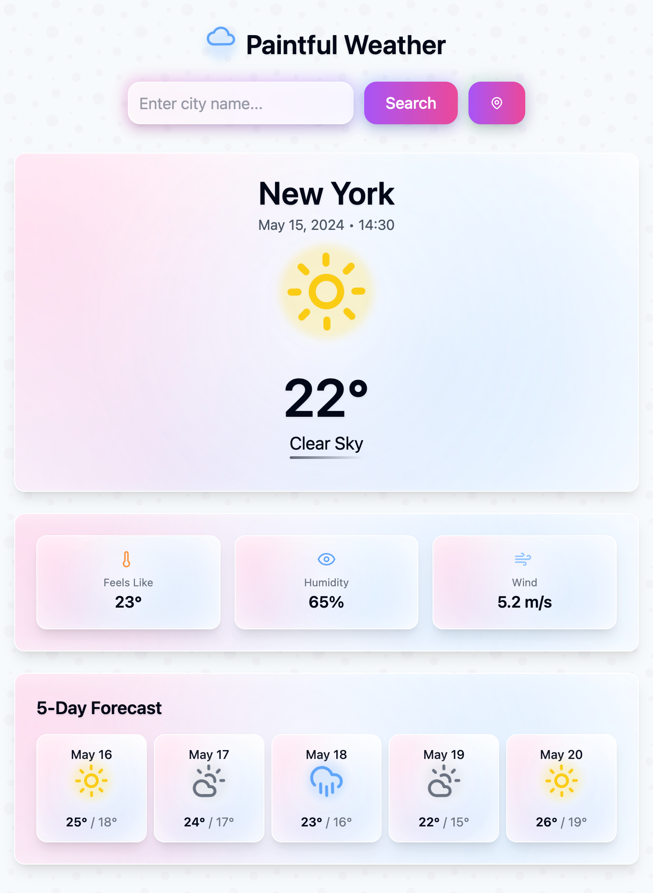

# Paintful Weather 🌤️



A beautiful and interactive weather application built with React, TypeScript, and modern UI components. Paintful Weather provides real-time weather information with a delightful user interface that changes based on the current weather conditions and time of day.

## Features ✨

- Real-time weather data using OpenWeatherMap API
- Dynamic weather-based theming that adapts to:
  - Current weather conditions (sunny, cloudy, rainy, etc.)
  - Time of day (day/night mode with moon and sun icons)
- Detailed weather information including:
  - Current temperature
  - Weather conditions
  - Humidity
  - Wind speed
  - "Feels like" temperature
  - 5-day forecast
- Interactive and intuitive user interface with:
  - Location search
  - Beautiful weather icons that change based on conditions and time
  - Responsive design for all devices
- Type-safe development with TypeScript
- Modern UI with smooth animations and transitions

## Tech Stack 🛠️

- **Frontend Framework:** React 18
- **Language:** TypeScript
- **Build Tool:** Vite
- **Styling:** Tailwind CSS
- **UI Components:** 
  - Radix UI primitives
  - Lucide React icons
  - Custom animated components
- **State Management:** React Query
- **Form Handling:** React Hook Form
- **Date Handling:** date-fns
- **API Integration:** OpenWeatherMap API
- **Animations:** Tailwind CSS animations
- **Notifications:** Sonner toast notifications

## Getting Started 🚀

### Prerequisites

- Node.js (v16 or higher)
- npm or yarn package manager
- OpenWeatherMap API key

### Installation

1. Clone the repository:
   ```bash
   git clone https://github.com/MISTERKID/paintful-weather.git
   cd paintful-weather
   ```

2. Install dependencies:
   ```bash
   npm install
   # or
   yarn install
   ```

3. Set up environment variables:
   - Copy the `.env.example` file to create a new `.env` file:
     ```bash
     cp .env.example .env
     ```
   - Open the `.env` file and add your OpenWeatherMap API key:
     ```
     VITE_OPENWEATHERMAP_API_KEY=your-api-key-here
     ```
   - You can get an API key by signing up at [OpenWeatherMap](https://openweathermap.org/api)

4. Start the development server:
   ```bash
   npm run dev
   # or
   yarn dev
   ```

5. Open your browser and navigate to `http://localhost:5173`

## Available Scripts 📝

- `npm run dev` - Start the development server
- `npm run build` - Build the production version
- `npm run build:dev` - Build the development version
- `npm run lint` - Run ESLint for code linting
- `npm run preview` - Preview the production build locally

## Features in Detail 🌟

### Weather Icons
- Dynamic icons that change based on:
  - Current weather conditions (sun, clouds, rain, etc.)
  - Time of day (moon with stars at night, sun during day)
  - Special effects for different weather conditions

### Time-Based Theming
- Automatic day/night mode based on location's time
- Different background colors and effects for:
  - Day time (warm colors)
  - Night time (cool colors)
  - Various weather conditions

### Location Search
- Search for any location worldwide
- Real-time weather updates
- Accurate timezone handling

## Contributing 🤝

Contributions are welcome! Please feel free to submit a Pull Request.

## License 📄

This project is licensed under the MIT License - see the LICENSE file for details.

## Acknowledgments 🙏

- [OpenWeatherMap](https://openweathermap.org/) for providing the weather data API
- [Radix UI](https://www.radix-ui.com/) for the accessible UI primitives
- [Lucide](https://lucide.dev/) for the beautiful icons
- All other open-source libraries used in this project

---

Made with ❤️ by Sai Seng Main
